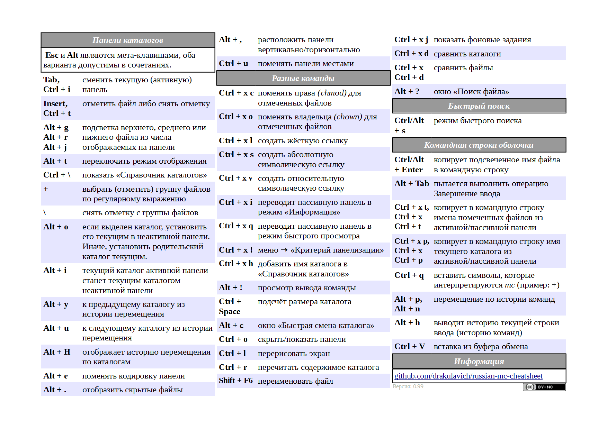

# Locations
- Windows: `$USER/AppData/Roaming/Midnight Commander`

# Notes
```bash
mc -b # run mc in white\black mode
```
- Remaps is possible, but hard...
- `Options > Configure` and uncheck "Use internal edit"

# Remember
- `Ctrl O` - command line interface
- `Ctrl S` - start search
- `Ctrl \` - open directory hotlist
- `Alt c` - quick cd
- `Ins` - select current item
- `Ctrl R` - refresh or rescan directory view
- `Ctrl x d` - Compare directories
- `Ctrl u` - swap panels
- `Alt i` - sync panels
- `Alt S` - jump to file in current pane/next match
- `Alt t` - cycle views
- `*` - invert selection
- `Mouse right click` - select file (maybe use Shift if not working)
- `Alt ?` - search for files
- `Ctrl l` - redraw screen
- `CTRL-x q` - toggle "quick view" mode with viewer in other panel
- `ALT-o` - open selected directory in other panel and moves selection to next directory
- `CTRL-x s` - create a relative path symbolic link to file/dir in other panel

## History
- `Alt h` - show history
- `ALT y` - go back a directory in history 
- `ALT u` - go forward a directory in history 

## Command prompt quick actions
- `Alt-Enter` on any file makes it appear on the prompt.
- `Ctrl-Shift-Enter` does the same thing, but with the full path
included.
- `Ctrl-x t` will type out all your selected files to the prompt.
- `Ctrl-x Ctrl-t` does the same for the opposing panel.
- `Ctrl-x p` or `Ctrl-a` will type out the current path to the prompt.
- `Ctrl-x Ctrl-p` will type out the opposing panel’s path to the
prompt.



# Sources
- https://trembath.co.za/mctutorial.html
- https://cheatography.com/fbo/cheat-sheets/midnight-commander/
- https://hamwaves.com/cli/doc/mc.pdf
- https://www.ratfactor.com/mc
- https://midnight-commander.org/wiki/ru/doc/filePanels/hotkeys
- https://aschernyshev.ru/all/midnight-commander-cheat-sheet/